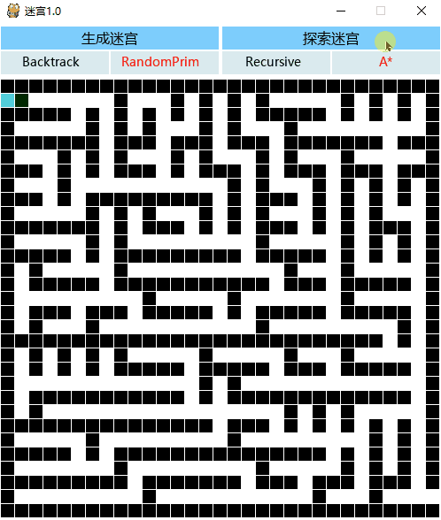
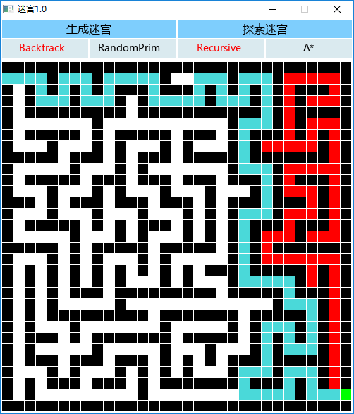

# 创造迷宫，探索迷宫
## 楔子：香农的老鼠

1951年，纽约比克曼酒店，科学研讨会。 在这次会议上，克劳德·香农带来了一个能走迷宫的“机器人”——尽管它外表不像人——给与会者留下了深刻印象，他们称它为“香农的老鼠“。

香农推出了一个柜子，柜面上是一个五乘五的网格。在二十五个方格之间可以任意放置隔板，从而构造出不同的迷宫。一个感应触头在两个小马达的驱动下可在四个方向上移动。在柜子里有一个约七十个继电器相互连接组成的阵列，它们各自的开关状态构成了机器人的“记忆”。 机器开启后，触头在迷宫里不断试错，有时会走进死胡同，有时会碰壁。最终，触头在众人瞩目之下走到了终点。这时触头上的灯泡亮起，铃声响起，马达停止了转动。

## 创造迷宫，探索迷宫
几乎所有介绍人工智能发展历史的书籍，都会把1956年8月在美国举行的达特茅斯会议（克劳德·香农也是与会者之一）作为人工智能的起点。但在我看来，1951年香农带来的那只“老鼠”已经预示了人工智能的巨大可能性，它生动展示了机器也能像人一样思考、决策、犯错，乃至学习，并在能力范围内寻找解决方案。

计算机技术的发展日新月异，当然已到了当年无法企及的地步。如今一个普通人就可以在电脑或手机上玩一些看起来极为复杂拟真的电子游戏，而游戏中那些华丽炫目的NPC也会自行寻路。他们也许借助相比过去已经极度便宜的存储和算力，使用了更好的算法，但本质上跟当年那只机器老鼠做的事情并无不同。

我参考网上的一些资料，写了一个小程序，可以随机创建迷宫、自动探索迷宫，算是回望人工智能起点的一个小小致敬。

### 创造迷宫
这里有两种创造迷宫的方法。 一种像是贪吃蛇在一片面包中爬行，沿途吃下尽可能多的食物，快要吃到自己的尾巴时，它就聪明的回退几步，换个方向继续穿行，直至再无多余食物可以吞下。最终通过面包上的坑洞呈现出的迷宫，绵长曲折。

另一种像是植物根系在土壤中生长，生命的活力沿着各个方向奔泻而出，但总是受到硬石砖墙的约束不能会合，直至长无可长。根系顶开了所有松软的泥土，余下的痕迹又是一个迷宫，短促多枝。

### 探索迷宫
这里有两种探索迷宫的方法。 一种是“不撞南墙不回头”，直冲冲的往前，遇到岔路就掷骰子决定方向，看似莽撞但也聪明的沿途留下标记，碰壁了就沿着来路退后几步，换个新方向继续冲，直至找到迷宫的出口。

另一种是“心有明灯执着向前”，好像迷宫出口处立着一座高塔，但却要通过曲里拐弯的弄堂小径才能到达，虽然一开始并不知道正确的道路，但在每处岔路都会遥望高塔来选择更趋近的走向。

**探索用方法1生成的迷宫：**

|探索1|探索2|
| ----- | ----- |
|||

**探索用方法2生成的迷宫：**

|探索1|探索2|
| ----- | ----- |
|||

## 程序说明
功能比较简单，没有太多可说的。

第一步选择生成迷宫的算法：Backtrack 或 RandomPrim ，然后点击 生成迷宫 即可随机创造迷宫；

第二步选择探索迷宫的算法：Recursive 或 A\* ，然后点击 探索迷宫 ，就会在左上角入口到右下角出口，自动探索出一条通路；

## 主要参考资料
[Python 四大迷宫生成算法实现(1): 递归回溯算法](https://blog.csdn.net/marble_xu/article/details/88201319)

[Python 四大迷宫生成算法实现(2): 随机Prim算法](https://blog.csdn.net/marble_xu/article/details/88285926)

[Python 四大迷宫生成算法实现(3): 递归分割算法](https://blog.csdn.net/marble_xu/article/details/89310401)

[Python 四大迷宫生成算法实现(4): 生成树+并查集算法](https://blog.csdn.net/marble_xu/article/details/89329862)

[Python 四大迷宫生成算法实现(5): 图形显示实现](https://blog.csdn.net/marble_xu/article/details/89735353)

